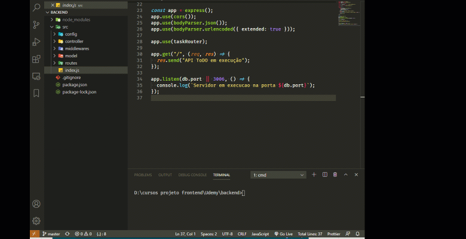

# todo-backend
projeto desenvolvido durante o curso na udemy. 
Este projeto funciona em conjunto com o [todo-mobile](https://github.com/jramaral/todo-mobile)  e [todo-web](https://github.com/jramaral/todo-web). 

